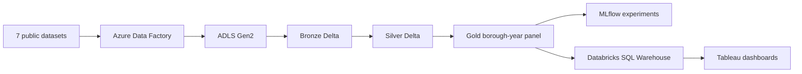
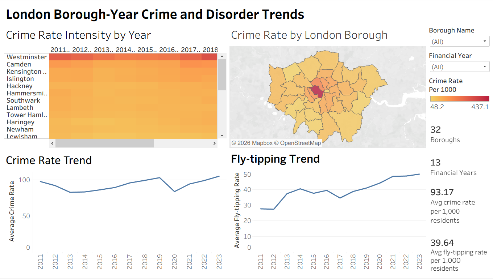
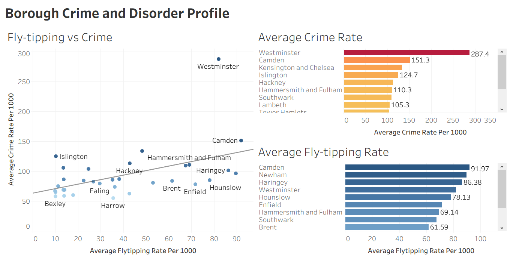
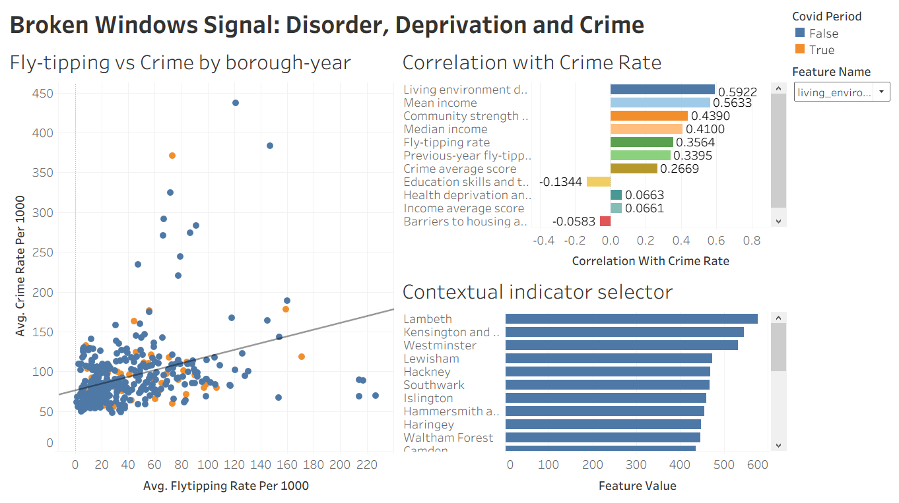
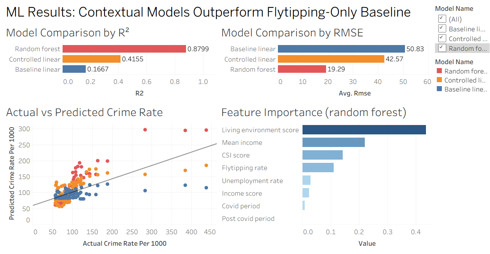

# London Urban Analytics Lakehouse

An end-to-end Azure lakehouse project that tests whether visible environmental disorder is associated with recorded crime across London boroughs. Fly-tipping is used as an observable proxy for disorder, while population, income, unemployment, civic strength and deprivation provide wider urban context.

The project is designed as a **longitudinal borough-year panel**, not a one-off cross-sectional comparison:

- **416 observations**: 32 London boroughs × 13 financial years (2011–12 to 2023–24)
- **7 public datasets** ingested and transformed through a Medallion Architecture
- **Time-based evaluation**: train through 2020–21, test on 2021–22 to 2023–24
- **Delta Lake, PySpark, MLflow and Tableau** used from ingestion to serving

> This is an observational analysis. The results show association and predictive value; they do not establish that fly-tipping causes crime.

## Architecture



A detailed editable diagram is available in [`docs/architecture.drawio`](docs/architecture.drawio).

## What the pipeline does

| Layer | Purpose | Main outputs |
|---|---|---|
| Bronze | Ingest heterogeneous CSV sources while retaining provenance and audit fields | Seven raw Delta tables plus an ingestion audit table |
| Silver | Standardise borough keys, reshape monthly/annual data, validate years and create clean domain tables | Crime, fly-tipping, population, income, unemployment, CSI and IMD tables |
| Gold | Join all sources at `borough_key + financial_year` and engineer analysis-ready rates and period flags | `gold_borough_year_panel` |
| Serving | Build compact analytical tables for correlations, predictions, feature importance and dashboard views | `cbda_tableau` tables and MLflow runs |

The Gold layer validates the expected 416 rows and rejects duplicate borough-year keys. Missing values are preserved or explicitly imputed and flagged rather than silently discarded.

## Results

Fly-tipping rate has a moderate positive same-year correlation with recorded crime rate (**r = 0.356, n = 411, p < 0.001**). In the training-period OLS analysis, the fly-tipping coefficient falls from **+0.305** in the single-feature baseline to **+0.210** after contextual controls are added, but remains statistically significant.

Held-out performance on 2021–22 to 2023–24:

| Model | RMSE | MAE | R² |
|---|---:|---:|---:|
| Linear regression — fly-tipping only | 50.83 | 24.85 | 0.1667 |
| Controlled linear panel model | 42.57 | 23.03 | 0.4155 |
| Random forest panel model | **19.29** | **11.03** | **0.8799** |

The results provide partial, conditional support for a Broken Windows signal. Environmental disorder matters, but wider living-environment, economic, civic and time context explains substantially more of the borough-level pattern.

## Dashboards

| Borough-year trends and map | Borough profiles |
|---|---|
|  |  |

| Broken Windows signal | Model comparison |
|---|---|
|  |  |

The public repository includes dashboard screenshots, but not the original Tableau workbook because it contains workspace-specific connection metadata. See [`tableau/README.md`](tableau/README.md).

## Repository structure

```text
.
├── config/
│   └── .env.example
├── data/
│   ├── README.md
│   └── data_dictionary.md
├── docs/
│   ├── architecture.drawio
│   ├── data_sources.md
│   ├── methodology.md
│   └── dashboards/
├── notebooks/
│   ├── 01_bronze_ingestion.ipynb
│   ├── 02_silver_transformations.ipynb
│   ├── 03_gold_borough_year_panel.ipynb
│   └── 04_analysis_mlflow_tableau.ipynb
├── tableau/
│   └── README.md
└── requirements.txt
```

## Reproducing the project

The notebooks are written for **Azure Databricks** and use Databricks-provided `spark`, `dbutils`, Delta Lake and `display` functionality.

1. Provision an ADLS Gen2 account and a Databricks workspace with access to it.
2. Download the seven public datasets listed in [`docs/data_sources.md`](docs/data_sources.md).
3. Rename and land the source files as `mps.csv`, `flytipping.csv`, `csi.csv`, `imd.csv`, `income.csv`, `population.csv` and `unemployment.csv`.
4. Set the environment variables shown in [`config/.env.example`](config/.env.example) on the Databricks cluster.
5. Import and run the notebooks in numerical order.
6. Connect Tableau to the `cbda_tableau` serving schema through a Databricks SQL Warehouse.

Public notebook outputs and workspace-specific endpoints have been removed deliberately. The notebooks retain the complete transformation and modelling logic.

## Technology

Azure Data Factory · ADLS Gen2 · Azure Databricks · PySpark · Delta Lake · Spark SQL · pandas · scikit-learn · SciPy · MLflow · Tableau · draw.io

## Author

**Hoang Hiep Ha**

## Licence

The project code and documentation are released under the [MIT Licence](LICENSE). Third-party datasets remain subject to their original providers' terms and are not redistributed in this repository.
